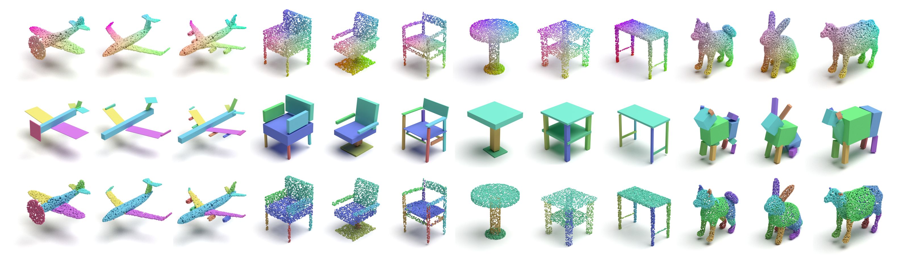

# Unsupervised Learning for Cuboid Shape Abstraction via Joint Segmentation from Point Clouds

This repository is a PyTorch implementation for paper:
[Unsupervised Learning for Cuboid Shape Abstraction via Joint Segmentation from Point Clouds](https://arxiv.org/abs/2106.03437). 
<br>
Kaizhi Yang, Xuejin Chen
<br>
SIGGRAPH 2021

## Introduction
Representing complex 3D objects as simple geometric primitives, known as shape abstraction, is important for geometric modeling, structural analysis, and shape synthesis. In this paper, we propose an unsupervised shape abstraction method to map a point cloud into a compact cuboid representation. We jointly predict cuboid allocation as part segmentation and cuboid shapes and enforce the consistency between the segmentation and shape abstraction for self-learning. For the cuboid abstraction task, we transform the input point cloud into a set of parametric cuboids using a variational auto-encoder network. The segmentation network allocates each point into a cuboid considering the point-cuboid affinity. In addition, several novel losses are designed to jointly supervise the two branches in terms of geometric similarity and cuboid compactness.

<p float="left">
    
</p>

## Dependencies
* Python 3.8.8.
* CUDA 10.2.
* PyTorch 1.5.1.
* TensorboardX for visualization of the training process.

## Dataset
We provide the ready-to-use datasets:
>[Dataset](https://drive.google.com/file/d/18ngs7hefXOptpuEHrLzeTUCT0Vn1Ou4l/view?usp=sharing)

Please unzip this file and set its path as the argument ```E_shapenet4096```.

## Pretrain models
>[Pretrain models](https://drive.google.com/file/d/1JQ0PC4cvHm_vELQbik1v9pErTVg9nxG6/view?usp=sharing)


## Training
```
python E_train.py --E_shapenet4096 PATH_TO_SHAPENET4096 --E_ckpts_folder PATH_TO_SAVE --D_datatype DATA_TYPE
```

## Inference
```
python E_infer.py --E_shapenet4096 PATH_TO_SHAPENET4096 --E_ckpt_path DIRECTORY_TO_CHECKPOINT --checkpoint CHECKPOINT_NAME
```

## Cite
Please cite our work if you find it useful:
```
@misc{yang2021unsupervised,
    title={Unsupervised Learning for Cuboid Shape Abstraction via Joint Segmentation from Point Clouds},
    author={Kaizhi Yang and Xuejin Chen},
    year={2021},
    eprint={2106.03437},
    archivePrefix={arXiv},
    primaryClass={cs.CV}
}
```

## License
MIT License
